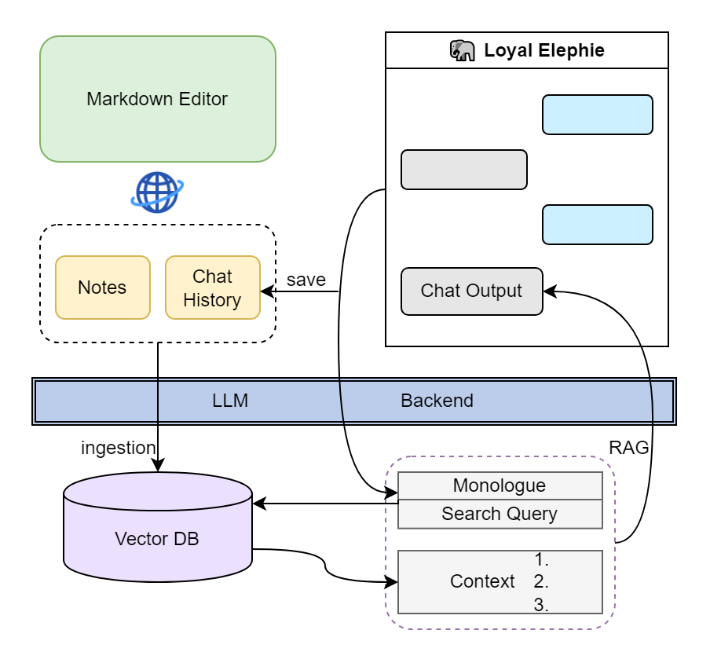
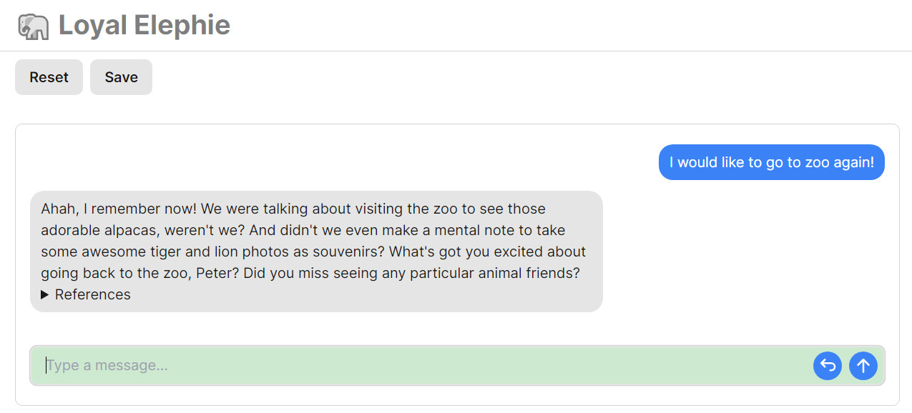
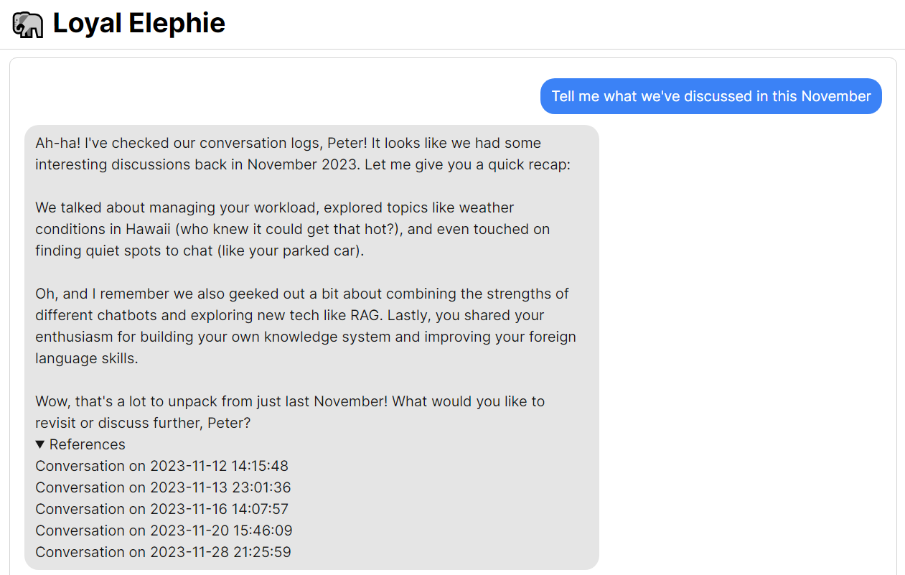
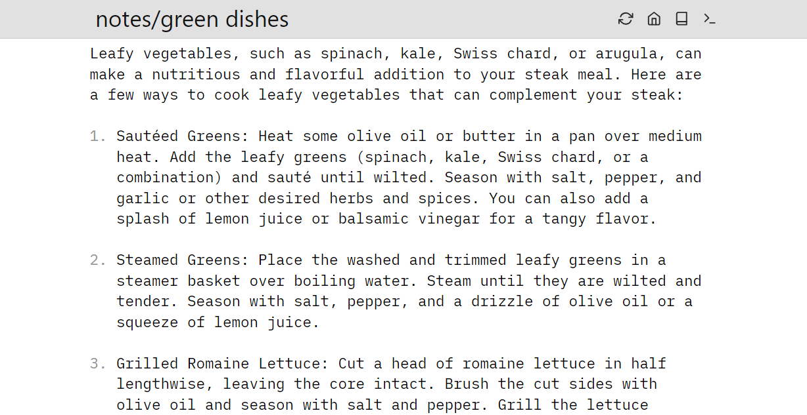
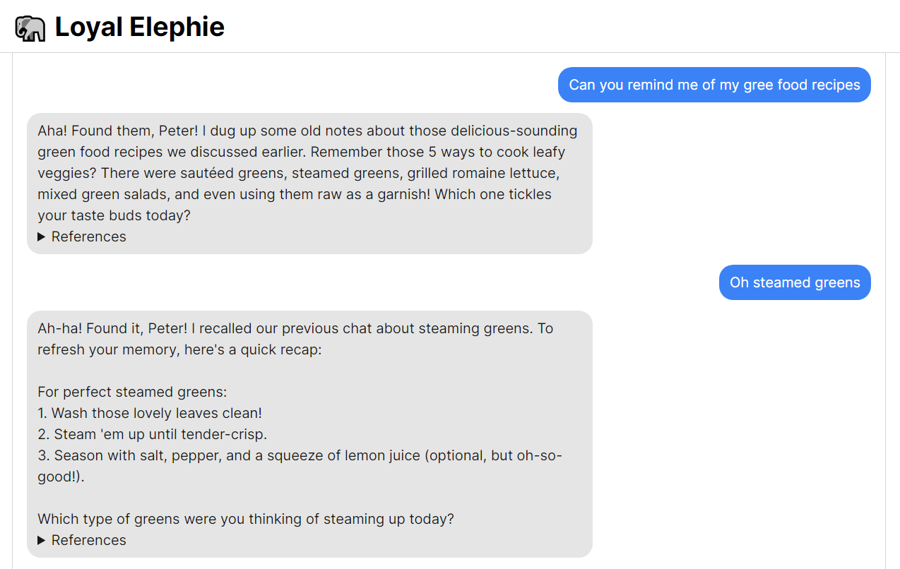

# 🐘 Loyal Elephie: Your Trusty Memory-enabled AI Companion 🧠
<p align="center">
  
</p>
🚀 Embark on a exciting adventure with Loyal Elephie, your faithful AI sidekick! This project combines the power of a neat Next.js web UI and a mighty Python backend, leveraging the latest advancements in Large Language Models (LLMs) and Retrieval Augmented Generation (RAG) to deliver a seamless and meaningful chatting experience! 🎉

## Features

1. **🎛️ Controllable Memory:** Take control of Loyal Elephie's memory! You decide which moments to save, and you can easily edit the context as needed. It is your second-brain for episodic memory. 📝

2. **🔍 Hybrid Search:** Experience the powerful combination of Chroma and BM25 for efficient searches! It's also optimized for handling date-based queries. 📅

3. **🔒 Secure Web Access:** With a built-in login feature, only authorized users can access your AI companion, ensuring your conversations remain private and secure over the internet. 🛡️

4. **🌐 Streamlined LLM Agent:** No function-calling required. Loyal Elephie is optimized for cached generation and works smoothly with great local LLMs running on Llama.cpp or ExllamaV2. 💬

5. **📝 (Optional) Markdown Editor Integration:** Connect with online Markdown editors to view the original referred document during chats and experience real-time LLM knowledge integration after editing your notes online. ✍️

Loyal Elephie supports both open and proprietary LLMs and embeddings serving as OpenAI compatible APIs. 



## Screenshots 
*Meta-Llama-3-70B-Instruct.Q4_K_S.gguf is used when capturing the below screenshots*







With [SilverBulletMd](https://github.com/silverbulletmd/silverbullet), you can edit a note on the browser and then let Loyal Elephie rememeber it!



The UI is modified from https://github.com/mckaywrigley/chatbot-ui-lite, credits to the author Mckay Wrigley!

## Deployment

**1. Clone Repo**

```bash
git clone https://github.com/v2rockets/Loyal-Elephie.git
```

**2. Install Frontend Requirments**

```bash
npm i
```

**3. Configure Login Users**

frontend/users.json
```json
[{
    "username":"admin",
    "password":"admin"
}]
```

**4. Install Backend Requirents**

```bash
pip install requirements.txt
```

**5. Configure Backend Settings**

```python
# backend/settings.py
NICK_NAME = 'Peter' # This is your nick name. Make sure to set it at the beginning and don't change so that LLM will not get confused.

CHAT_BASE_URL = 'https://api.openai.com/v1' # Modify to your OpenAI compatible API url
CHAT_API_KEY = 'your-api-key'
CHAT_MODEL_NAME = "gpt-3.5-turbo"
```

**6. Run App**

frontend:
```bash
npm run build
npm run start
```
backend:
```bash
python app.py
```

# Usage Tips
* use "Save" button to save the current conversation into Loyal Elephie's memory.
* use "Reset" button to clear the current conversation (it won't affect save status), it's the same as refreshing page.
* click on the titles in "Reference" to navigate to the corresponding Markdown note (but SilverBulletMd or other web Markdown editors has to be hosted and configured).

Some of the workable local LLMs tested:
* OpenHermes-2.5-Mistral-7B
* Phi-3-Medium-4k-instruct
* Mixtral-8x7B-Instruct-v0.1
* Meta-Llama-3-70B-Instruct (Best so far) 

